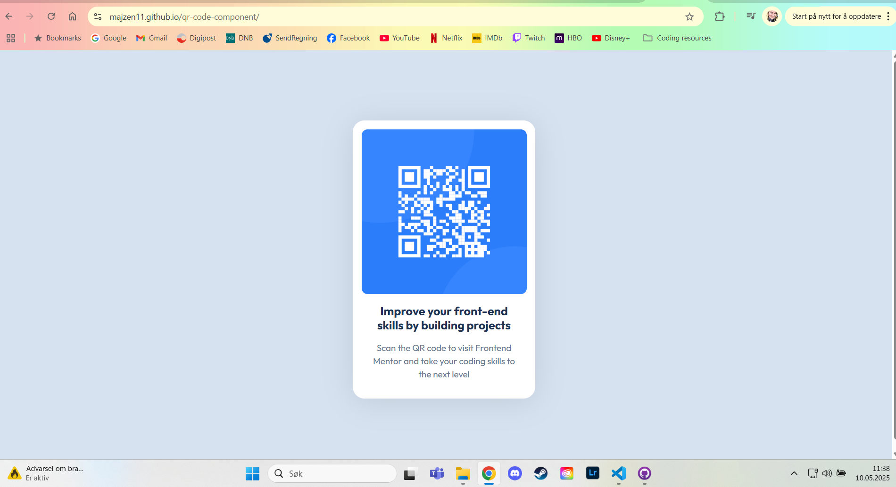

# Frontend Mentor - QR code component solution

This is a solution to the [QR code component challenge on Frontend Mentor](https://www.frontendmentor.io/challenges/qr-code-component-iux_sIO_H). Frontend Mentor challenges help you improve your coding skills by building realistic projects. 

## Table of contents

- [Overview](#overview)
  - [Screenshot](#screenshot)
  - [Links](#links)
- [My process](#my-process)
  - [Built with](#built-with)
  - [What I learned](#what-i-learned)
  - [Continued development](#continued-development)
  - [Useful resources](#useful-resources)
- [Author](#author)

## Overview

### Screenshot

### Links

- Solution URL: [Add solution URL here](https://your-solution-url.com)
- Live Site URL: https://majzen11.github.io/qr-code-component/

## My process

### Built with

- Semantic HTML5 markup
- CSS custom properties
- Flexbox
- Mobile-first workflow

### What I learned

I learned a bit more about using flexbox, specifically centering an object. I found the basic way to do this, but kept struggling. The box would center horizontally, but not vertically. After some googling I found a forum post of someone struggling with the same issue and a solution to my problem. My element lacked height, so flexbox didn't know to center it. But when I added "height: 100vh;" it worked.

I'm unsure if I chose my sizing the correct way. I used the mobile size as my starting point and picked an inline-size in pixels based on that. I think it looks like it might be a little bit too small on my phone, but the design looks right compared to the design-images I got. Maybe there's a better way to do this.

I was unsure if I needed to add a section to my html, but concluded that since i needed a div anyway, it was probably fine without.

### Continued development

As this is one of my very first projects, I still have a lot to learn. I feel like I'm understanding the basic concepts of html and css, but I need to practice more to get it under my skin. I don't yet remember all the tags and properties that I've learned, so I keep having to look it up. But I suppose that's normal for a beginner.

I would like to learn more about responsive design. I don't know if my design should be different to be more accessible, but since it used the mobile size as a starting point, I assume it should be fine.

I want to learn more about semantic html to be certain that i use it correctly.

I want to learn to use flexbox and grid in more detail.

### Useful resources

This guide to flexbox was helpful.
- [CSS-tricks.com](https://css-tricks.com/snippets/css/a-guide-to-flexbox/)

I struggled to get my box centered both vertically and horizontally. These pages helped med find the base code to do it.
- [W3 Schools](https://www.w3schools.com/css/css_align.asp) 
- [CSS-tricks.com](https://css-tricks.com/centering-css-complete-guide/)

## Author

- Frontend Mentor - [@majzen11](https://www.frontendmentor.io/profile/Majzen11)
- LinkedIn - (https://www.linkedin.com/in/maja-korb%C3%B8l-54199a120/)

